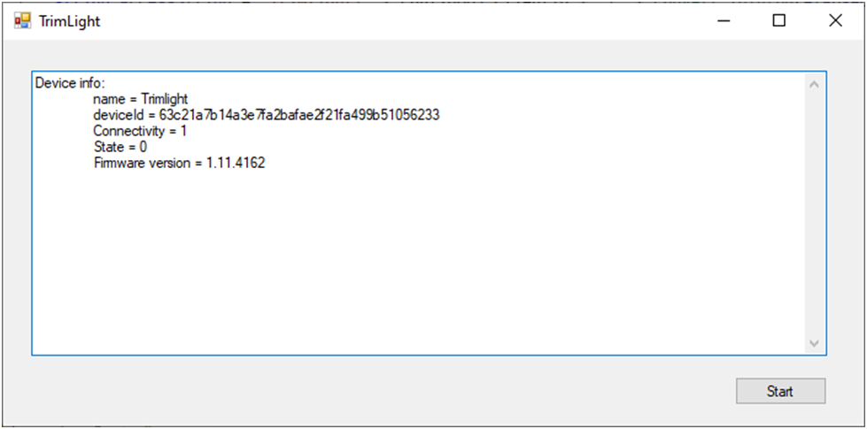

**Disclaimer**
I’m not the best programmer in the world, not even close. This project is intended to provide additional psuedo-documentation to the Trimlight API documentation. I spent a fair amount of time trying to figure out how to code to their spec (See the opening sentence).
The code is written in C# and entire project should be buildable if you have Visual Studio.
I’ve tried to set up github as a collaborative project but this is the first time I’ve done it so no telling if I’ve got it set up correctly.  My intent was that people could add code to further the “documentation” of the API.  I will certainly try to add new features as I figure things out.

**Trimlight API documentation**
Trimlight  API documentation . As of April 18, 2024 this document is incorrect. I have asked Trimlight to publish a new version of the document that they have shared with me or allow me to post the shared doc here on github. Still awaiting a response from trimlight.

**Config.cs**
This class is instantiated at form startup and is passed around as a container to hold frequently used items. At the time of this writing there are three items stored within a config object; the clientId, the clientSecret, and the base URI to reference.

**App.config**
The project uses the App.config file to pass values such as the clientId and clientSecret into the code so that they are not hard coded.  The App.config file is referenced within the config.cs class.
I have changed the values of the clientId and clientSecret. They do not match personal values. Contact trimlight for your personal clientId and client Secret. 

<?xml version="1.0" encoding="utf-8" ?>
<configuration>
    <startup> 
        <supportedRuntime version="v4.0" sku=".NETFramework,Version=v4.7.2" />
    </startup>
	<appSettings>
		<add key="clientId" value="BilboBaggins"/>
		<add key="clientSecret" value="bD!t8%cOPm3%dmNaT!zd5#GHA5q17&amp;ie"/>
		<add key="baseURI" value="https://trimlight.ledhue.com/trimlight"/>
	</appSettings>
</configuration>

**Windows Form application**
The application runs as a Windows form. There isn’t much to it. Clicking the “Start” button creates a web request, builds the appropriate headers, add the headers to the request and then sends a GET to "/v1/oauth/resources/devices" to get a list of devices associated with me.
I dump a few items, well most of them, to the screen just so you can see that it’s working.
 
**Form1.cs**
This is the bulk of the code. The getDevices() method builds the HTTP request, sends it, and dumps it on the screen.

**trimlightDevices class**
I took the json response from the GET to "/v1/oauth/resources/devices" and created this class. I used a JSON  -> C# class web form that I found to create it.  I use NewtonSoft JSON packages to deserialize the JSON in to an object in the Form1.cs file. 

**Use of Newtonsoft**
The code uses the Newtonsoft.Json package to manipulate JSON strings. I have version 13.0.0.0 installed at the time of this writing (April 18, 2024). 
